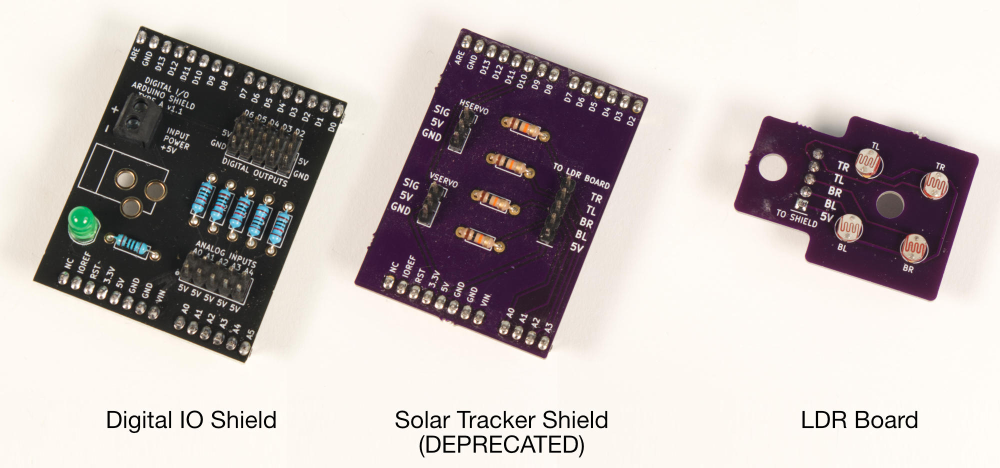

# Dual Axis Solar Tracker V3

For a full build guide visit: https://browndoggadgets.dozuki.com/Guide/Dual+Axis+Solar+Tracker+3.0/382

## Solar Tracker Shield and LDR Board

The new (as of October 2021) [Digital IO Shield](hardware/Digital-IO-Arduino-Shield-Type-A-v1.1) is a general purpose Arduino shield and replaces the old version of the Solar Tracker Shield. Any Solar Tracker sold after October 2021 will use the Digital IO Shield and will require that you use the Arduino sketch `Dual_Axis_Tracker_V3.ino`

(The old [Solar Tracker Shield](hardware/Solar-Tracker-Shield-v1.1) was used previous to the release of the Digital IO Shield in October 2021. If you are using this older version of the Solar Tracker Shield you will need to use the Arduino sketch `Dual_Axis_Tracker_V2.ino`)

[The Light-Detecting Resistor (LDR) Board](hardware/LDR-Board) is a board with four photocells and male pin headers. It connects to the Digital IO Shield with female jumper wires.

Both of the shields work with the Arduino Uno board and have male pin headers for connecting the servos and light detecting resistors (via female jumper wires).

## Test and Setup of Servos

The Arduino sketch `Servo_Test.ino` should be used to ensure your servos both work once connected to the shield. (The Arduino and shield must be powered for the servo test to work.)

The Arduino sketch `Servo_Set_Mid.ino` will set both servos to the 90 degree (mid) point and is useful to run before doing assembly of the tracker.

## Hardware

The majority of screws are 3/4th inch 8-32 pan head screws, one half inch 8-32 screw, one 2.5 inch 8-32 screw, along with four #2 wood screws to mount the servo horns, and two M3 screws to mount the Arduino Uno.  Rubber feet are necessary for the bottom of the base.

## Laser Cut Files

Use a laser cutter or CNC router to cut the parts out. Use 1/4th inch and 1/8th inch plywood for this project. A 1 inch by 1 inch reference square has been put on the laser cut design to to allow for adjustment if importing causes resizing problems.

