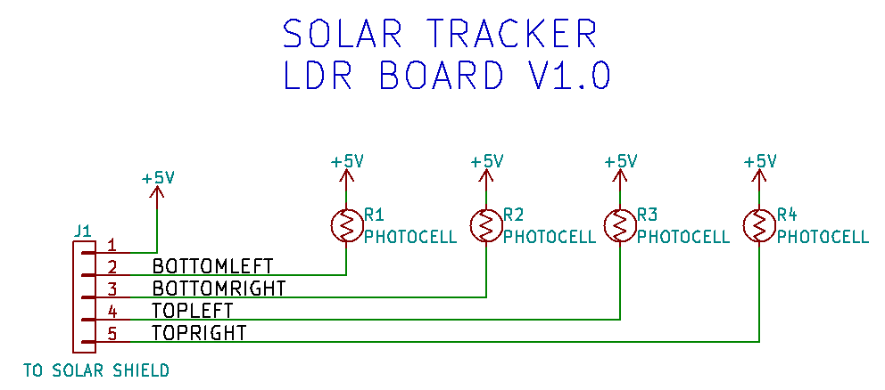
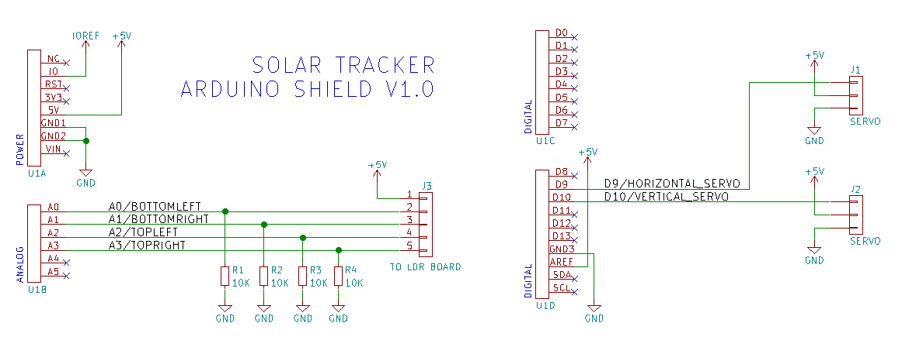

# Solar Tracker Shield and LDR Board

[Solar Tracker Shield](hardware/Arduino-Shield) is a half-size Arduino Uno board with a screw terminal connector. 

[The Light-Detecting Resistor (LDR) Board](hardware/LDR-Board) is a board with four photocells and a matching screw terminal connector. 

The two boards should be connected by running individual wires between the two connectors, which can be tightened with a jeweler's screwdriver. 

