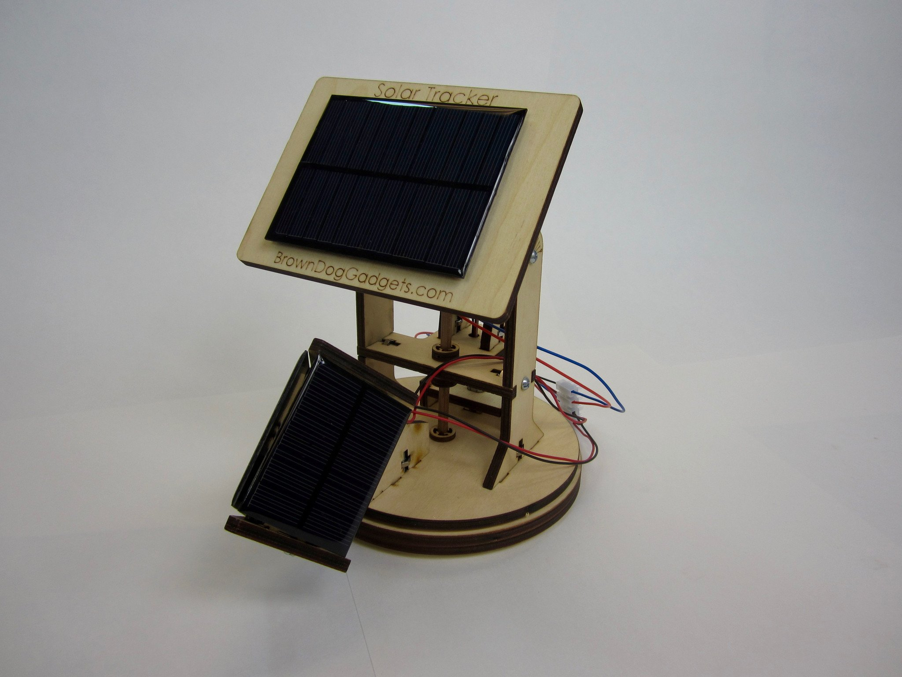

# Dumb Tracker

This simple tracker uses a geared mechanism to move the entire body around a stationary base.  Instead of digital sensors and a processing unit, this relies on a single geared motor and two solar cells.

The project uses  quarter inch thick material (birch plywood), a dowel rod, a common 6V 35 RPM metal gear motor, and two 6V 80mA solar cells. Additional supplies needed are screws, screw terminal blocks, wire, and rubber feet. Optional: A larger solar cell for the face and a LED volt meter.

Tool wise, you need access to a laser cutter or CNC machine able to cut quarter inch material, screw drivers, wire cutter and stripper, and a soldering iron to attach wires to the solar cells and motor.

While this project works decently in good sunlight it suffers in low light conditions since it is self powering. The project is also annoying to assemble for such a simple concept.

We eventually morphed this project into the "smart" Single Axis Tracker. This proved to be a more interesting project and an easier physical build.

On a side note, we originally modeled this project on a simple YouTube video that used a motor with a rubber stopper on the shaft, two solar cells, and a lazy susan for the body. (A project much more simple than what this project morphed into.)
