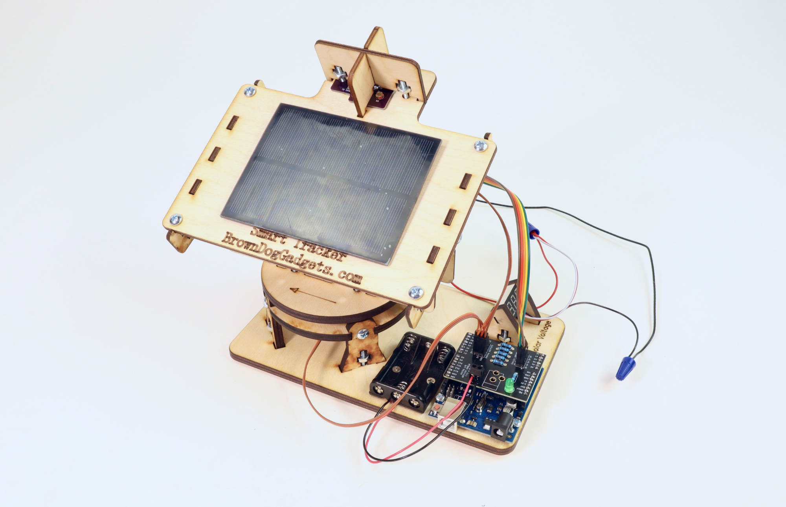

# Solar Tracker

Files and Resources for our Dual and Single Axis Solar Smart Trackers as well as our Single Axis "Dumb" Tracker.

# Overview

The idea behind these projects was to create a beginner level activity that had a real world application.  The Dual Axis Tracker used a common Arduino Uno and a Sensor Shield to move two servos and follow the light.  We took inspriation and code from existing solar tracking projects on instructables.com and provided a more useful lasercut body.

After the popularity of our Dual Axis Tracker we also designed a more simple "Dumb" Tracker that used a common Metal Gear Motor (6V 35 RPM) to move along a single axis. Two small 6V 80mA solar cells acted as both sensors and power for the motor.  While less electronicly complicated the project ended up being a much more awkward and difficult build.

Version 2 of the Dual Axis Tracker streamlined the physical build by replacing about half the 1/4th inch wood pieces with 1/8th inch pieces, lowering the strain on the two servos.  A custom designed Arduino Shield and LDR Sensor holder made the electronics much easier. Version 3 is a futher refinement and uses an improved Digital IO Shield for connecting the servos and LDR sensors to the Arduino.

A new version of the Single Axis Tracker was also designed along the same lines, going with mostly 1/8th inch wood.  Instead of using an Arduino Uno it uses a Crazy Circuits Robotics Board (Nano) as well as the same LDR Sensor holder from the V2 Dual Axis.  A single servo moves the body along a single axis.  
