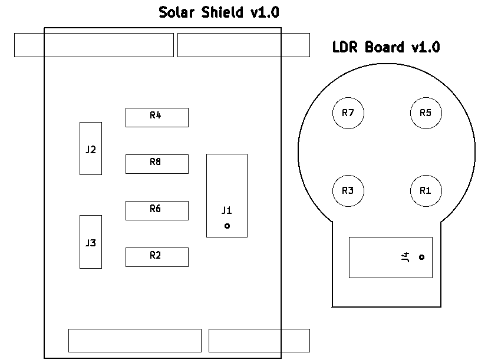

# Solar Tracker Shield and LDR Board

Solar Tracker Shield is a half-size Arduino Uno board with a screw terminal connector. 

The Light-Detecting Resistor (LDR) Board is a board with four photocells and a matching screw terminal connector. 

The two boards should be connected by running individual wires between the two connectors, which can be tightened with a jeweler's screwdriver. 

|Ref|Qty|Description|Mfr|Mfr PN|Digikey PN|
|---|---|-----------|---|------|----------|
|J2,J3|1|HEADER MALE 40POS TH 1x40 0.1"|Sullins|PREC040SAAN-RC|S1012EC-40-ND|
|J1,J4|2|CONN TERM SCREW GREEN 2.54MM 5POS TH|OnShoreTech|OSTVN05A150|ED10564-ND|
|R1,R3,R5,R7|4|PHOTOCELL 3K-11K OHM 5.10MM|Luna Opto|PDV-P8001|PDV-P8001-ND|
|R2,R4,R6,R8|4|RES 10K OHM 1/4W 5% CF MINI|Stackpole|CFM14JT10K0|S10KQCT-ND|

Note: it's much cheaper to just buy one 40-pin 0.1"-pitch male header and break it into pieces that are 6, 8, 8, 4, 3, and 3 pins wide.   

